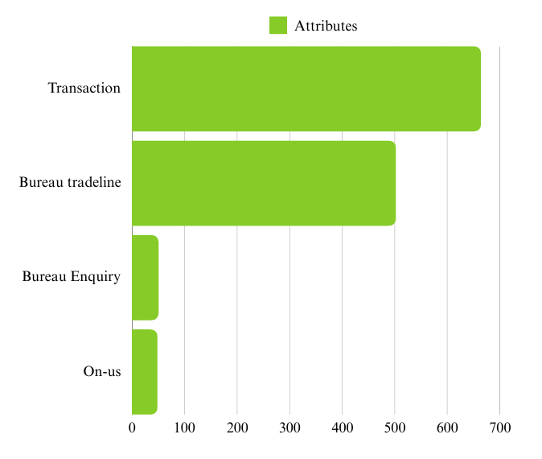
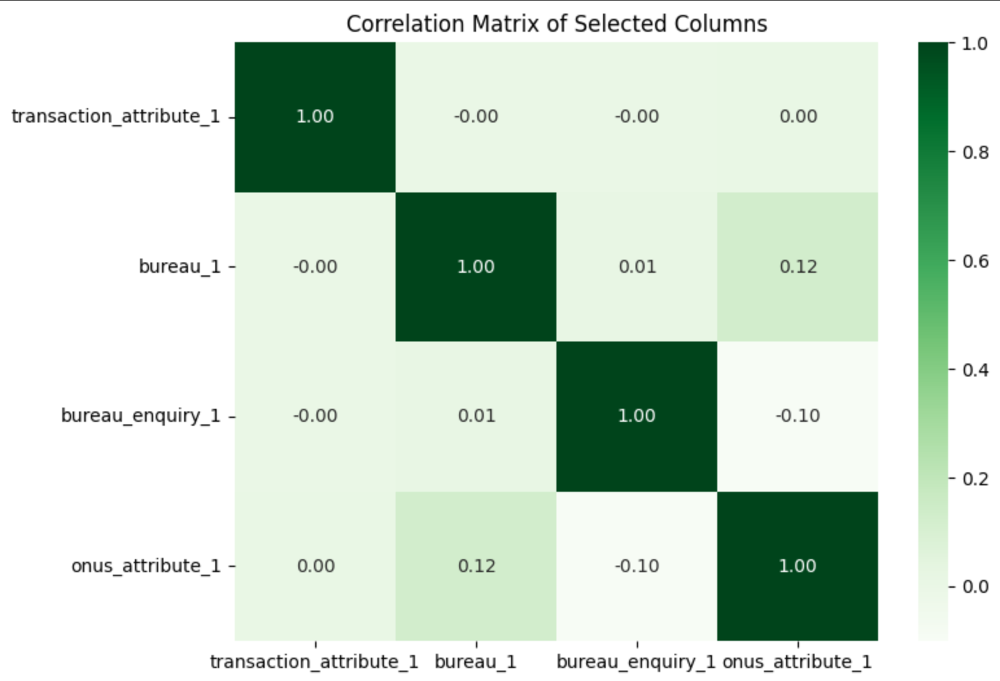
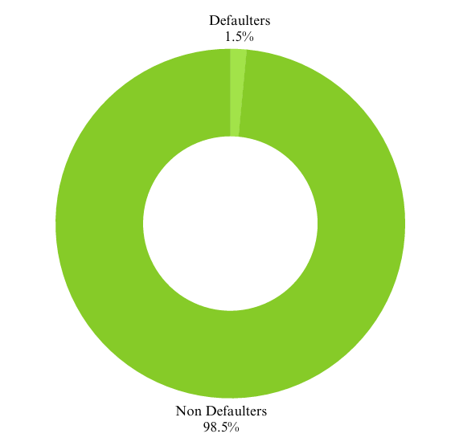
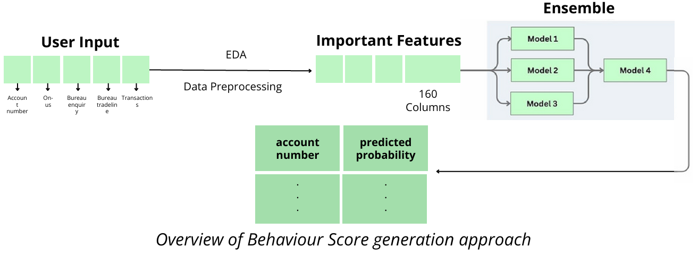
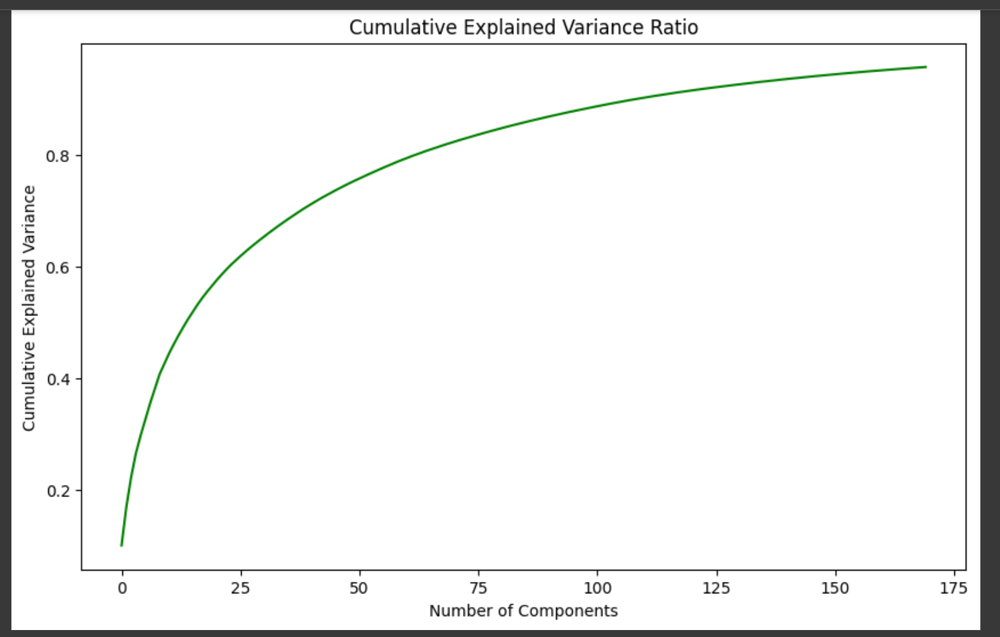
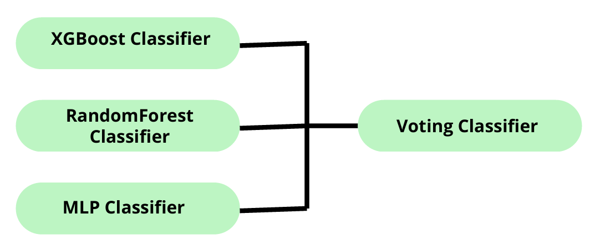

# Credit Card Behavior Score: Convolve 3.0

## Table of Contents
1. [Introduction](#introduction)
2. [Problem Statement](#problem-statement)
3. [Dataset Description](#dataset-description)
   - [Development Data](#development-data)
   - [Validation Data](#validation-data)
   - [Feature Categories](#feature-categories)
4. [Objectives](#objectives)
5. [Methodology](#methodology)
   - [Data Preprocessing](#data-preprocessing)
   - [Feature Engineering](#feature-engineering)
     - [Synthetic Minority Oversampling Technique (SMOTE)](#synthetic-minority-oversampling-technique-smote)
     - [Principal Component Analysis (PCA)](#principal-component-analysis-pca)
   - [Classification Models](#classification-models)
     - [Random Forest Classifier](#random-forest-classifier)
     - [XGBoost Classifier](#xgboost-classifier)
     - [MLP Classifier](#mlp-classifier)
   - [Ensemble Approach](#ensemble-approach)
6. [Evaluation Metrics](#evaluation-metrics)
7. [Results](#results)
8. [Conclusion](#conclusion)
9. [Annexure](#annexure)

---

## Introduction
This project, **Convolve 3.0**, focuses on developing a **Credit Card Behavior Score** to predict the likelihood of default among credit card customers. The primary goal is to assist financial institutions in managing risks effectively by leveraging machine learning models to identify customers at risk of default, enabling timely and proactive interventions.

---

## Problem Statement
Maintaining a healthy portfolio of credit card accounts is crucial for financial institutions. Bank A aims to:
- Proactively identify credit card accounts at risk of default.
- Use data-driven approaches to assess customer behavior.
- Minimize potential losses by implementing timely interventions.

The guiding principle of this project is, **"Prevention is better than cure."**

---

## Dataset Description

### Development Data
The development dataset consists of **96,806 credit card accounts**, each containing:
- Independent variables: A mix of transaction, bureau, and on-us attributes.
- Target variable: `bad_flag` (1 = default, 0 = no default).

### Validation Data
The validation dataset includes **41,792 accounts**, with the same features as the development dataset but no target variable. The objective is to predict default probabilities for these accounts.

### Feature Categories
The dataset features fall into four categories:
1. **Transaction Attributes**: 664 features.
2. **Bureau Tradeline Attributes**: 502 features.
3. **Bureau Enquiry Attributes**: 50 features.
4. **On-us Attributes**: 48 features.

No significant correlation was seen among the feature groups.

Key observation: The distribution of the target variable (`bad_flag`) is **highly imbalanced**, with:
- **98.5%** non-defaulters.
- **1.5%** defaulters.

---

## Objectives
1. Develop a **Behavior Score** to identify customers at risk of defaulting on credit card payments.
2. Minimize potential losses by enabling **early interventions**.
3. Prioritize **profitable customers** while managing exposure to risk.
4. Provide **tailored repayment plans** or financial advice to at-risk customers.
5. Ensure compliance with financial regulations through a **transparent, data-driven framework**.

---

## Methodology

### Data Preprocessing
1. **Dropping Columns**: Removed features with >10% missing values (695 columns).
2. **Imputation of Null Values**: Missing data imputed using the mean of each column.
3. **Data Scaling**: Used **StandardScaler** to standardize features, ensuring all variables contribute equally to the models.

### Feature Engineering
#### Synthetic Minority Oversampling Technique (SMOTE)
- Addressed the class imbalance (1.5% defaulters).
- Generated synthetic samples for the minority class by interpolating between existing samples and their nearest neighbors.
- Improved model performance on the minority class while avoiding overfitting.

#### Principal Component Analysis (PCA)
- Performed **dimensionality reduction** to address high dimensionality (1,264 features).
- Retained the most important components by capturing maximum variance.
- Enhanced computational efficiency while reducing noise.

### Classification Models
#### Random Forest Classifier
- **Description**: Ensemble learning method combining multiple decision trees.
- **Key Strengths**:
  - Handles large datasets, missing values, and noisy data effectively.
  - Provides feature importance scores.
- **Performance**:
  - Accuracy: **99.52%**
  - F1 Score: **0.9952**
  - AUC-ROC: **0.9997**

#### XGBoost Classifier
- **Description**: Optimized gradient boosting algorithm designed for structured data.
- **Key Strengths**:
  - Regularization to prevent overfitting.
  - Handles missing values and complex relationships.
- **Performance**:
  - Accuracy: **98.62%**
  - F1 Score: **0.9863**
  - AUC-ROC: **0.9991**

#### MLP Classifier
- **Description**: A feedforward neural network consisting of input, hidden, and output layers.
- **Key Strengths**:
  - Captures non-linear relationships.
  - Handles diverse feature domains effectively.
- **Performance**:
  - Accuracy: **98.77%**
  - F1 Score: **0.9878**
  - AUC-ROC: **0.9952**

### Ensemble Approach
- Combined the predictions of Random Forest, XGBoost, and MLP using a **Voting Classifier**.
- **Performance**:
  - Accuracy: **99.52%**
  - F1 Score: **0.9952**
  - AUC-ROC: **0.9999**
 

---

## Evaluation Metrics
1. **Accuracy**: Measures the proportion of correct predictions.
2. **F1 Score**: Harmonic mean of precision and recall, balancing false positives and false negatives.
3. **AUC-ROC**: Evaluates model performance across different thresholds, especially for imbalanced datasets.

---

## Results
- The ensemble model achieved exceptional performance, outperforming individual models in terms of accuracy, precision, recall, and AUC-ROC.
- The behavior score model demonstrated robust predictive capabilities, making it a reliable tool for identifying risky credit card accounts.

---

## Conclusion
The developed Credit Card Behavior Score successfully identifies customers at risk of defaulting, enabling timely and effective risk management. By combining state-of-the-art machine learning techniques and ensemble learning, the project achieves high accuracy and interpretability, ensuring compliance with financial regulations.
